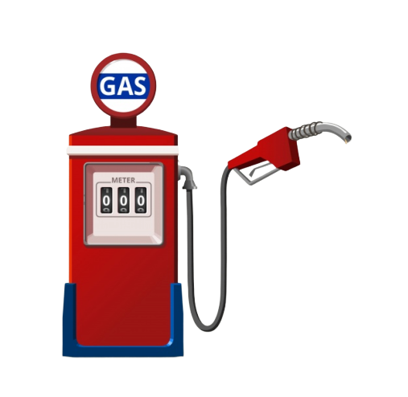

  <h1 align="center">
   
    
   
   
  MyFuel
  </h1>

  
 An application for fuel expense control 🚗⛽

## Features

This app features all the latest tools and practices in web development!

- ⚛ **React Native** — A library to build user interfaces
- ♻ **Redux with Redux Saga** — State management with middleware
- 💅 **CSS** — styled-components
- 🌸 **Reactotron** - Helps debugging process
- 💖 **Lint** — ESlint/Prettier/Editor Config

## Getting started

_Before you run this application you need to make sure the [server](https://github.com/dudubernardino/MyFuel-Api) is running!_.

1. Clone this repo using `https://github.com/dudubernardino/MyFuel-Mobile`
2. Run `yarn` to install dependencies. 
3. Run `yarn start`.
4. Run `react-native run android` or `react-native run ios`

## Contributing

Please read [CONTRIBUTING.md](CONTRIBUTING.md) for details on our code of conduct, and the process for submitting pull requests.

## License

This project is licensed under the MIT License - see the [LICENSE.md](LICENSE.md) file for details.